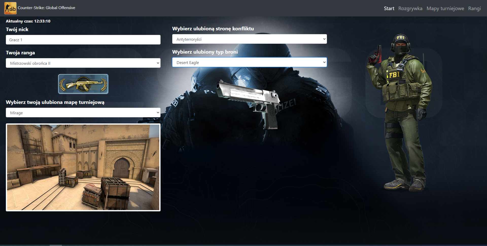
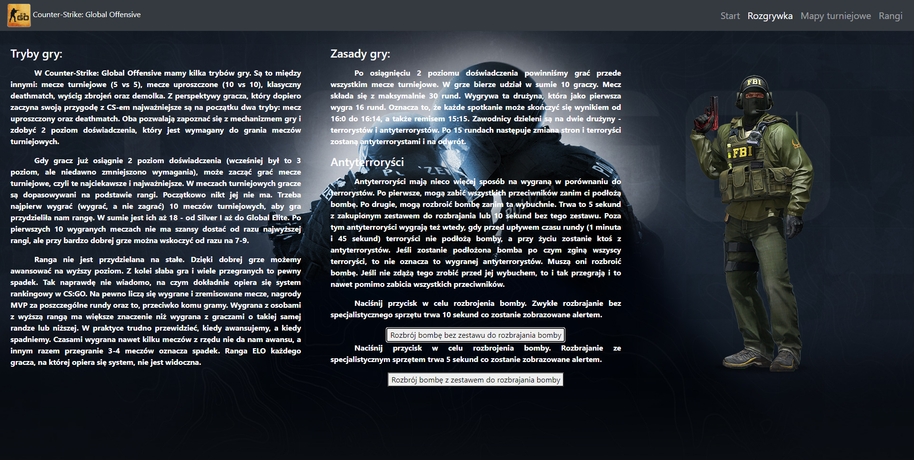
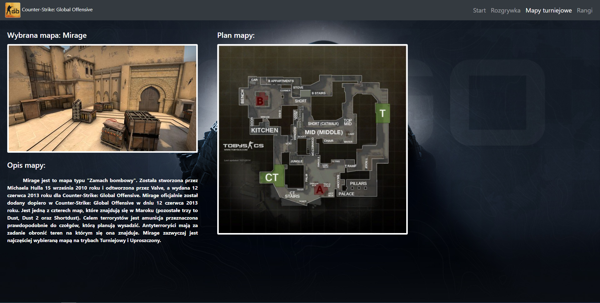
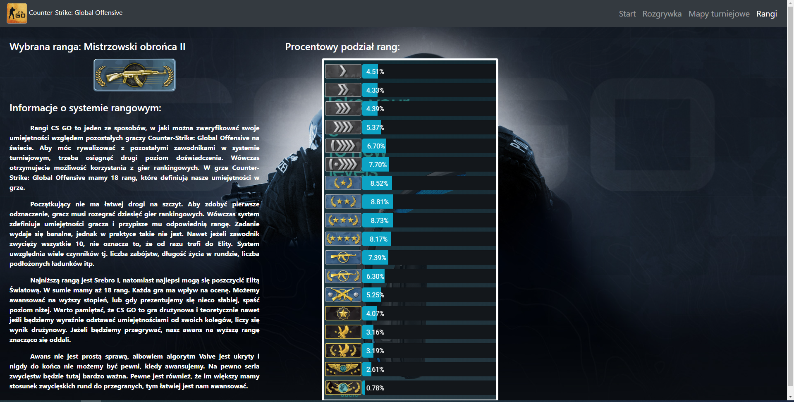

# Counter-Strike: Global Offensive - Website

## Table of Contents
* [General Information](#general-information)
* [Technologies Used](#technologies-used)
* [Screenshots](#screenshots)
* [Setup](#setup)

## General Information
The project contains basic information about Counter-Strike: Global Offensive game. User can find out about the basic rules of the game such as gameplay, conflict sides, the most popular tournament maps as well as ranks. 
The selection of particular rank, tournament map and conflict side in the Start tab determines a view and a content of subsequent tabs.      

The website has been created in order to practise and consolidate material concerning basics of creation of websites by technologies such as HTML, CSS and JavaScript
as a part of programming course. The requirements which had to be met for the project:
- individual files for CSS style sheets and JS scripts,
- minimum of 3 HTML files and using href attribute which navigates to subpage,   
- using setTimeout() and setInterval() methods,
- styling by classes, tags and identifiers,
- adding of EventListeners in JavaScript,
- communication between HTML pages,
- using the Bosostrap framework.

## Technologies used
- HTML
- CSS
- JavaScript
- Bootstrap 4

## Screenshots

  
  
  
  

# Setup
- git clone [repository] or download ZIP and unzip this file
- double click on MainPage html file to open a website